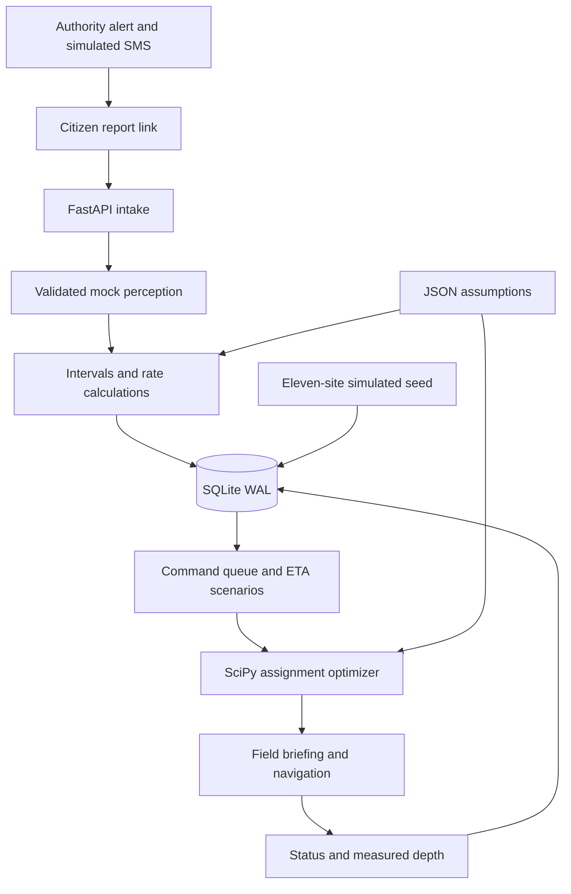

# Waterline

> Crowd-sourced disaster triage that turns citizen reports into depth and visible-void estimates with uncertainty, compares conditions at responder arrival, and helps commanders allocate teams.

Waterline is our planned project for **Hacktoberfest Hack Day — Coimbatore 2026**, organized by INIT CLUB × iDEA CLUB in collaboration with Major League Hacking. This is the initial working mock prototype, based on the team's **Waterline Master Build Specification v1.0**. Every output is advisory: the incident commander decides.

## Team

**Team name:** October Grinch. **Project name:** Waterline.

| Member | Contribution status |
| --- | --- |
| Abhishek Bharathi | Team member; individual responsibilities and completed contributions to be recorded |
| Aadithya Ram | Team member; individual responsibilities and completed contributions to be recorded |
| Aadidev | Team member; individual responsibilities and completed contributions to be recorded |
| Sanjay S M | Team member; individual responsibilities and completed contributions to be recorded |

OpenAI Codex assisted with this initial implementation and documentation. This does not establish individual member contributions; update the table when the team confirms its work.

## Problem statement

Flood and structural-collapse emergencies generate scattered citizen observations while rescue resources are limited. Photos may show water against familiar objects or openings in rubble, but cannot directly establish depth, interior conditions or future access. A site that looks less severe now can become more urgent before a team arrives.

We chose this problem to connect community observations with a practical coordination workflow: alert residents, collect reports from secure locations, preserve uncertainty, consider delays and allocate suitable teams. Flooding and structural damage share this coordination problem while needing different physical models.

## Solution

The intended workflow is **authority alert → tokenised citizen link → geotagged photos → validated perception → deterministic calculation → arrival-time priority → dispatch → field feedback**. Residents report conditions, authority operators create alerts, commanders review rankings, and responders confirm conditions on site.

Hazard labels include flash flood, cyclone, earthquake, and El Niño-associated extreme rain. El Niño is a climate-pattern label with no photographable signature. Flooding uses the flood module; earthquake, wind or flood-related structural failure uses the collapse module.

### Initial working features

- Authority form, random reporting links tied to alert records, and simulated SMS outbox.
- Mobile citizen reporting: situation, people count, vulnerability flags, one to four photos, optional note, coordinates, image resize, progress and retry.
- SQLite persistence, circle-geofence warnings, nearby flood clustering and average-hash duplicate detection.
- Validated canned **mock flood extraction** for uploads. It does not assess actual photo contents.
- Eleven simulated seed incidents and seven teams, populated without photos or AI calls.
- Command queue, point-marker map, ETA scale, three depth scenarios, thresholds, deadlines, uncertainty flags and navigation links.
- Collapse demo cards: aperture ranges, advisory search order, structural hazard flags and crew class from mass upper bound.
- One-team-per-site assignment, field status/measurement forms, and benchmark calculations from recorded ground truth only.

### Planned features

Live vision with validation/retries/fallback and three-run flood extraction; real collapse-photo and note/voice processing; validated EXIF capture time/GPS; full professionally reviewed playbook; map editors; authentication, rate limits, privacy deletion and retention; deployment. Real SMS, multilingual controls, calibration, OSRM routing and AI-rephrased briefings are optional milestones. See [the implementation plan](docs/IMPLEMENTATION.md) for requirement-by-requirement status.

## Innovation and differentiation

Waterline separates perception from measurement: the planned model selects a landmark ID and waterline bin, while code computes intervals, fuses references and blends noisy rise-rate observations with explicit assumptions.

Headline priority describes severity at arrival. Dispatch optimizes the benefit of arriving earlier, which decreases with delay. Using worsening severity directly as an allocation objective could incorrectly reward sending a team later. Collapse planning uses visible apertures, reported people, hazards and an explicitly illustrative time-decay curve; it cannot determine a person's condition or clear a structure for entry.

## Technical implementation

### Architecture



### Technology stack

| Category | Technologies / status |
| --- | --- |
| Language | Python; spec target 3.11, initial checks use 3.12 |
| Backend | FastAPI, Uvicorn, Pydantic v2 |
| Database | Standard-library SQLite, WAL mode |
| Numerical computation | NumPy, SciPy `linear_sum_assignment` |
| Images | Pillow, python-multipart |
| Frontend | HTML, CSS, vanilla JavaScript, Leaflet 1.9.4 via CDN; no Node build |
| AI / ML | Canned mock flood extraction; no live model used |
| Planned AI client | google-genai dependency; live adapter pending |
| Configuration | JSON files and python-dotenv |
| Tests | pytest, FastAPI TestClient and httpx |
| Maps | OpenStreetMap tiles and external navigation links |
| Infrastructure / SMS | Local server and simulated outbox; public deployment N/A |

### How it works

An alert stores a circle geofence and UTC event time. Server-stored random tokens associate reporting links with recipients. Sending writes to the simulated outbox, never to phones.

Uploads are resized, hashed and stored with generated filenames. Outside-geofence reports are flagged. Duplicate photos do not add an independent observation to an existing cluster. Mock references produce depth intervals; code fuses recent observations, fits slopes, blends rate priors and flags extrapolated or inconsistent evidence. Initial uploads use submission time and browser/entered coordinates; EXIF handling is pending.

The command view projects best, expected and worst depth scenarios and ranks by severity at nominal ETA. Collapse fixtures compute visible-zone plausibility and crew from upper-bound mass. Nearby collapse/flood fixtures receive a compound flag. Dispatch checks projected depth, vehicle/boat constraints and flow, then maximizes arrival benefit through rectangular assignment. Field measurements feed benchmark calculations; no measurements means no accuracy result.

### Technical decisions

- Retain Appendix A's reference physics unchanged and test Appendix B's golden assignment before interface work.
- Load editable references, rates, thresholds, team specifications and survival assumptions from JSON. Several internal reference coefficients remain fixed; expose them through tested adapters in a later milestone.
- Always use mock perception and deterministic templates in this build. Setting `VISION_PROVIDER=gemini` does not enable a live adapter; health reports the actual `mock` mode.
- Use synthetic Coimbatore seed coordinates. Seed depths, apertures, hazard cues and occupancy are simulated assumptions.
- Keep the project at repository root. SQLite tables contain structured JSON payloads for the initial schema.
- Use opaque server-stored random tokens rather than the specification's stateless HMAC format.

### Structure

```text
app/
  main.py, db.py, models.py, settings.py
  physics.py, dispatch.py, dispatch_reference.py, fusion.py, guidance.py, seed.py
  config/   references, rates, thresholds, teams, occupancy, survival, templates
  vision/   validated mock extraction and planned prompt contract
  static/   command, authority, citizen and field pages
tests/      golden mathematics, assignment and API tests
docs/       implementation status and roadmap
data/       private SQLite database (ignored)
uploads/    private images (ignored)
```

## Implementation during the hackathon

This initial milestone contains reference mathematics and tests, configuration, persisted mock reports, the eleven-site seed, command/citizen interfaces, simulated alert sending, dispatch and field feedback. This records repository work, not event completion history or individual member contributions. The team should add confirmed contributions and hackathon chronology as work progresses.

Live AI, real SMS, deployment, professionally validated procedures and real-photo accuracy have not been established. The specification's two-hour schedule is a proposed plan, not a measured completion claim.

## Setup and usage

### Prerequisites

Python 3.11 or newer and Git. Python 3.12 was used for initial validation. Internet is needed for dependency installation, Leaflet CDN assets and OpenStreetMap tiles. If Leaflet loads but tiles fail, markers can remain on a blank background; if the CDN is unavailable, the queue and site cards still work.

### Windows PowerShell

```powershell
git clone https://github.com/B-Sheikh/Hacktoberfest-October-Grinch.git
cd Hacktoberfest-October-Grinch
py -3.11 -m venv .venv
.\.venv\Scripts\python.exe -m pip install -r requirements.txt
Copy-Item .env.example .env
.\run.ps1
```

Select an installed compatible Python version if 3.11 is unavailable. The current workspace uses bundled Python 3.12.

### macOS / Linux

```sh
git clone https://github.com/B-Sheikh/Hacktoberfest-October-Grinch.git
cd Hacktoberfest-October-Grinch
python3 -m venv .venv
.venv/bin/python -m pip install -r requirements.txt
cp .env.example .env
sh run.sh
```

Open [Command](http://localhost:8000/command), [Authority](http://localhost:8000/authority) or [API docs](http://localhost:8000/docs). Click **Seed demo**, select a site, change ETA scale and run dispatch. Open an assigned field page to record status or measurements. For citizen reporting, create an authority alert with any demo recipient label and open the link in the simulated outbox. No real phone number is required.

### Environment variables

No credentials are required for mock mode. `.env`, databases, uploads and local development files are ignored.

| Variable | Current use |
| --- | --- |
| `WATERLINE_DB` | SQLite path, default `data/waterline.db` |
| `WATERLINE_UPLOADS` | Image folder, default `uploads` |
| `PUBLIC_BASE_URL` | Prefix for reporting links |
| `VISION_PROVIDER`, `VISION_MODEL`, `GEMINI_API_KEY` | Reserved; initial adapter always mock |
| `BRIEFING_PROVIDER` | Reserved; initial briefings always templates |
| `HMAC_SECRET` | Reserved; current tokens use secure random generation |
| `TWILIO_SID`, `TWILIO_TOKEN`, `TWILIO_FROM` | Reserved; initial sending always simulated |

ETA, mobilisation, vehicle limits and thresholds live in `app/config/`. Restart after configuration changes. Times are stored in UTC; alert input uses browser local time. Asia/Kolkata is the configured display default; complete timestamp rendering is pending.

### Phone access

Phone geolocation and camera access need HTTPS. For a supervised demo, use `cloudflared tunnel --url http://localhost:8000` or `ngrok http 8000`, set `PUBLIC_BASE_URL` to the resulting HTTPS URL and restart. Real-phone HTTPS has not yet been verified. Operator authentication is pending: use only a controlled demonstration with non-sensitive data.

### Verification

```powershell
.\.venv\Scripts\python.exe -m pytest -q
```

Where the default temporary folder is restricted, specify a fresh workspace folder with `--basetemp=.local/test-run`. Tests cover numerical golden values, monotone benefit, ETA ×1/×2 assignments, idempotent seed, ranked output, mock receipts, duplicates, invalid tokens/images, geofence warnings, outbox, field updates and page responses. API checks do not establish browser visual quality or real-photo accuracy.

## Assumptions and limitations

| Assumption | Editable configuration / verification needed |
| --- | --- |
| Typical reference dimensions | `references.json`; measure local objects |
| Rate priors and visual velocities | `rates.json`; local hydrology review |
| Depth cap, hazard floors, context thresholds, tiers and vulnerability | `thresholds.json`; rescue-professional review |
| Aperture tolerance, body fit and collapse factors | `thresholds.json`; staged measurements and SAR review |
| Density, mass classes and extrication times | `thresholds.json`, `survival.json`; engineering/SAR review |
| Occupancy | `occupancy.json`; local data, live inference pending |
| Illustrative time-decay curve | `survival.json`; not an individual's outcome probability |
| Fleet limits, speed, mobilisation and detour | `teams.json`; actual fleet and route validation |

A photo cannot see inside rubble. Apertures can be upper bounds on interior height. Waterline does not classify individual outcomes or authorize entry. There is no citywide flood surface, terrain model or hydrodynamic forecast. Projections assume the rate continues and may miss peaks or recession. No structure or approach is cleared by a missing hazard flag.

Travel is approximate; road closures, approach depths and equipment availability are unknown. The priority index is relative, not a probability, and cross-hazard comparisons are not precise equivalences. Every estimate and action needs human oversight.

Phone labels, notes, locations and images are stored locally with no face recognition. There is no automatic retention or deletion endpoint yet. Use synthetic data in this initial build. Authentication, token/IP rate limits, report invalidation, secure deployment and privacy controls remain required before wider use.

## Challenges and learnings

- Allocation benefit must decrease with delay even as displayed severity increases; separate golden tests protect this distinction.
- Two reports can yield a rise-rate estimate dominated by interval noise. Blending and visible uncertainty are essential.
- Inconsistent and open-ended intervals need explicit flags rather than a deceptively precise midpoint.
- Collapse photography offers surface evidence only; upper-bound mass and careful wording preserve this limitation.
- Visible mock labels keep a dependable no-AI demo from being mistaken for real scene analysis.
- Phone HTTPS and poor connectivity matter. Resize/retry is implemented; metadata preservation and durable offline queuing remain pending.

## Open source and AI usage

FastAPI, Pydantic, NumPy, Pillow, httpx, python-multipart, python-dotenv, pytest and Leaflet provide web, validation, numerical, image and interface functionality under permissive licenses. SciPy and Uvicorn use BSD licenses; google-genai uses Apache-2.0. Installed distribution license files are authoritative, including transitive components.

Leaflet is loaded via unpkg. OpenStreetMap tiles show contributor attribution; underlying map data uses ODbL. No live model or external training dataset is used by this build. Demo scenarios are synthetic. OpenAI Codex assisted with implementation, documentation and tests and is not a runtime dependency.

## Credits and license

- Team-supplied **Waterline Master Build Specification v1.0**: Appendix A physics, Appendix B assignment scenario and Section 12 expected values. The Word source is not copied into the repository.
- [Defra / Environment Agency FD2320 project record](https://www.gov.uk/flood-and-coastal-erosion-risk-management-research-reports/flood-risk-assessment-guidance-for-new-development): hazard-to-people source family named by the spec. Waterline's additional floors are assumptions.
- [INSARAG Guidelines](https://insarag.org/methodology/insarag-guidelines/): collapse-methodology reference; project factors still need professional validation. No certification or endorsement is claimed.
- NDMA and NWS guidance are named sources for the planned playbook; per-rule grounding remains pending.

**Project license:** Pending team selection. No license grant for team-owned code is claimed by this initial commit. Third-party components retain their own licenses.

## Working application, demo and Devpost

- **Local application:** [Command](http://localhost:8000/command) while the server runs.
- **Public deployment:** Not deployed.
- **Demo video:** Not recorded.
- **Devpost submission:** Not created or linked.

Suggested demo: seed eleven sites, compare ETAs, inspect collapse zones and HOLD/SHORE FIRST flags, dispatch teams, open field guidance, then create a simulated alert and submit a mock photo. Keep mock badges visible in recordings.

## Submission checklist

- [x] Project, problem, selection rationale and solution documented
- [x] Four team members listed
- [x] Architecture, setup, assumptions and limitations documented
- [x] Reference mathematics and golden tests included
- [x] Mock mode, seed, arrival scenarios, ranking, dispatch and navigation included
- [ ] Confirm team name, contributions and event implementation history
- [ ] Complete live extraction and metadata pipeline
- [ ] Review guidance and validate assumptions with professionals
- [ ] Add security/privacy controls and test a phone over HTTPS
- [ ] Collect staged measurements and report measured accuracy
- [ ] Deploy, record demo and complete Devpost submission
- [ ] Select project license
