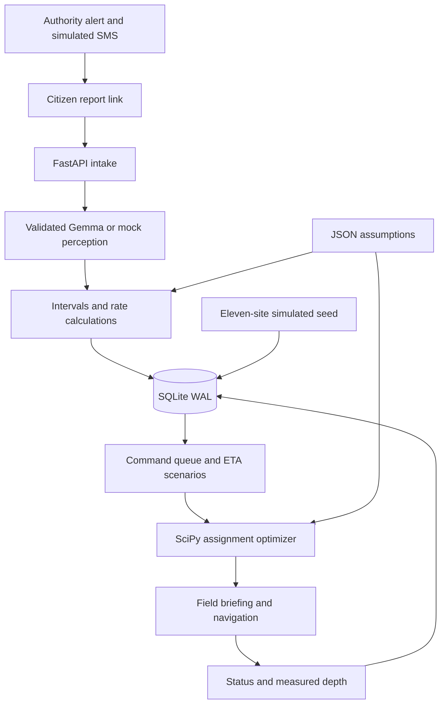

# Waterline

> Crowd-sourced disaster triage that turns citizen reports into depth and visible-void estimates with uncertainty, compares conditions at responder arrival, and helps commanders allocate teams.

Waterline is our planned project for **Hacktoberfest Hack Day — Coimbatore 2026**, organized by INIT CLUB × iDEA CLUB in collaboration with Major League Hacking. This is a working prototype with hosted Gemma flood extraction and an offline mock demo, based on the team's **Waterline Master Build Specification v1.0**. Every output is advisory: the incident commander decides.

## Team

**Team name:** October Grinch. **Project name:** Waterline.

| Member | Assigned responsibility |
| --- | --- |
| Abhishek Bharathi | AI perception, model integration and deterministic hazard calculations |
| Aadithya Ram | Office administration, authentication, resident registry and alert campaigns |
| Aadidev | Public portal, civilian reporting, photo upload and location capture |
| Sanjay S M | Command dashboard, team dispatch, responder workflows and integration verification |

These are assigned development responsibilities, not claims of completed individual contributions. Confirmed project work includes repository preparation, feature organization, deployment configuration and submission materials directed by Abhishek Bharathi. Individual completed code contributions for the other members have not been confirmed. OpenAI Codex assisted with implementation, documentation and verification.

## Problem statement

Flood and structural-collapse emergencies generate scattered citizen observations while rescue resources are limited. Photos may show water against familiar objects or openings in rubble, but cannot directly establish depth, interior conditions or future access. A site that looks less severe now can become more urgent before a team arrives.

We chose this problem to connect community observations with a practical coordination workflow: alert residents, collect reports from secure locations, preserve uncertainty, consider delays and allocate suitable teams. Flooding and structural damage share this coordination problem while needing different physical models.

## Solution

The intended workflow is **authority alert → tokenised citizen link → geotagged photos → validated perception → deterministic calculation → arrival-time priority → dispatch → field feedback**. Residents report conditions, authority operators create alerts, commanders review rankings, and responders confirm conditions on site.

Hazard labels include flash flood, cyclone, earthquake, and El Niño-associated extreme rain. El Niño is a climate-pattern label with no photographable signature. Flooding uses the flood module; earthquake, wind or flood-related structural failure uses the collapse module.

### Initial working features

- Main office dashboard with resident registration, SMS consent, map-based locality targeting, recipient/message preview, campaign and report counters, and simulated SMS outbox.
- Public civilian portal: select a locality and office alert to report without needing an SMS first.
- Mobile citizen reporting: situation, people count, vulnerability flags, one to four photos, optional note, map-selected location, image resize, progress and retry.
- SQLite persistence, circle-geofence warnings, nearby flood clustering and average-hash duplicate detection.
- Hosted **Gemma 4 image extraction** for flood photos: three runs per image, strict schema validation, bin fusion, retry/backoff and bounded concurrent calls.
- Explicit offline mock extraction; live AI failures are saved for manual review without simulated measurements. Unsupported scenes and unusable references are saved for manual review without automated ranking.
- Eleven simulated seed incidents and seven teams, populated without photos or AI calls.
- Command queue, point-marker map, ETA scale, three depth scenarios, thresholds, deadlines, uncertainty flags and navigation links.
- Collapse demo cards: aperture ranges, advisory search order, structural hazard flags and crew class from mass upper bound.
- One-team-per-site assignment, a team directory and a responder workspace for photos, notes, status and measured depth. Uploaded evidence and field observations appear in the assigned site’s report history.
- Benchmark calculations from recorded ground truth only.

### Planned features

Real collapse-photo and note/voice processing; validated EXIF capture time/GPS; full professionally reviewed playbook; polygon area editing; public-report rate limits, separate responder accounts, privacy deletion and retention; deployment hardening. Real SMS, multilingual controls, calibration, OSRM routing and AI-rephrased briefings are optional milestones. See [the implementation plan](docs/IMPLEMENTATION.md) for requirement-by-requirement status.

## Innovation and differentiation

Waterline separates perception from measurement: the model selects a landmark ID and waterline bin, while code computes intervals, fuses references and blends noisy rise-rate observations with explicit assumptions.

Headline priority describes severity at arrival. Dispatch optimizes the benefit of arriving earlier, which decreases with delay. Using worsening severity directly as an allocation objective could incorrectly reward sending a team later. Collapse planning uses visible apertures, reported people, hazards and an explicitly illustrative time-decay curve; it cannot determine a person's condition or clear a structure for entry.

## Technical implementation

### Architecture



### Technology stack

| Category | Technologies / status |
| --- | --- |
| Language | Python; spec target 3.11, initial checks use 3.12 |
| Backend | FastAPI, Uvicorn, Pydantic v2 |
| Database | Standard-library SQLite, WAL mode |
| Numerical computation | NumPy, SciPy `linear_sum_assignment` |
| Images | Pillow, python-multipart |
| Frontend | HTML, CSS, vanilla JavaScript, Leaflet 1.9.4 via CDN; no Node build |
| AI / ML | Gemma 4 26B A4B instruction-tuned model (`gemma-4-26b-a4b-it`) through the hosted Gemini API; explicit offline mock mode |
| AI client | google-genai; validated JSON, three-run flood ensemble, retries and concurrency limit |
| Configuration | JSON files and python-dotenv |
| Tests | pytest, FastAPI TestClient and httpx |
| Maps | OpenStreetMap tiles and external navigation links |
| Infrastructure / SMS | Render-hosted prototype and local development; simulated SMS outbox |

### How it works

An alert stores a circle geofence and UTC event time. The office matches opted-in residents by registered location and snapshots those recipients when creating the campaign. Consent is checked again when simulating sending. Each recipient has a personal random reporting link; each alert also has a shared public reporting link. Repeated send requests skip already processed recipients. Sending writes to the simulated outbox, never to phones. The website cannot discover every phone physically in a locality; this prototype targets the resident registry.

Uploads are resized, hashed and stored with generated filenames. Outside-geofence reports are flagged. Duplicate photos do not add an independent observation to an existing cluster. AI-selected or mock references produce depth intervals; code fuses recent observations, fits slopes, blends rate priors and flags extrapolated or inconsistent evidence. Initial uploads use submission time and browser or map-selected coordinates; EXIF handling is pending.

The command view projects best, expected and worst depth scenarios and ranks by severity at nominal ETA. Collapse fixtures compute visible-zone plausibility and crew from upper-bound mass. Nearby collapse/flood fixtures receive a compound flag. Dispatch checks projected depth, vehicle/boat constraints and flow, then maximizes arrival benefit through rectangular assignment. Field measurements feed benchmark calculations; no measurements means no accuracy result.

### Technical decisions

- Retain Appendix A's reference physics unchanged and test Appendix B's golden assignment before interface work.
- Load editable references, rates, thresholds, team specifications and survival assumptions from JSON. Several internal reference coefficients remain fixed; expose them through tested adapters in a later milestone.
- `VISION_PROVIDER=gemini` enables hosted Gemma when a key is present; `mock` keeps the demo offline. Health reports configured mode, not a guarantee of successful inference. Every receipt and site records actual extraction status (`ok`, `retry_ok`, `mock`, `failed` or `manual_review`). Briefings remain deterministic templates.
- Live extraction sends only resized JPEGs and the perception prompt to Google. No model measurements or rescue procedures are accepted; code performs the calculations. Non-flood scene processing remains pending.
- Gemma 4 uses minimal thinking for image extraction to avoid extended reasoning delays, with a 45-second per-call deadline and a 90-second whole-report deadline. Uploads wait up to 120 seconds for the server response. API errors, invalid JSON and timeouts save the original photos for manual review, without substituted mock measurements or automated priority. Fixed diagnostic codes identify rate limits, missing keys, provider timeouts and invalid output without exposing SDK exception text. Missing/unusable references are not substituted with a guessed measurement. A real re-analysis is not blocked as a duplicate by a previous mock/failed attempt.
- Use synthetic Coimbatore seed coordinates. Seed depths, apertures, hazard cues and occupancy are simulated assumptions.
- Keep the project at repository root. SQLite tables contain structured JSON payloads for the initial schema.
- Use opaque server-stored random tokens rather than the specification's stateless HMAC format.

### Structure

```text
app/
  main.py, common.py, db.py, settings.py   shared application infrastructure
  office/         admin access, residents and alert campaigns
  citizen/        public reporting and evidence intake
  intelligence/   AI perception, physics and incident fusion
  operations/     command, dispatch, guidance and responders
  config/         shared editable assumptions
  static/         shared browser screens and frontend utilities
tests/            verification by feature and public API
docs/             implementation status and roadmap
data/             private SQLite database (ignored)
uploads/          private images (ignored)
```

## Four feature areas

| Folder | Feature | Development owner |
| --- | --- | --- |
| [`app/office/`](app/office/README.md) | Office administration and alert campaigns | Aadithya Ram |
| [`app/citizen/`](app/citizen/README.md) | Citizen reporting and evidence intake | Aadidev |
| [`app/intelligence/`](app/intelligence/README.md) | AI perception and hazard calculations | Abhishek Bharathi |
| [`app/operations/`](app/operations/README.md) | Command coordination and responder operations | Sanjay S M |

Each folder contains working feature code and a detailed README covering its files, workflow, endpoints, dependencies, verification and known limits. `app/main.py` composes the four FastAPI routers and applies the shared authentication boundary. Database lifecycle, configuration and reusable browser assets remain shared to avoid duplication. Existing public URLs and the `app.main:app` startup command are preserved.

## Implementation during the hackathon

This initial milestone contains reference mathematics and tests, configuration, persisted mock reports, the eleven-site seed, command/citizen interfaces, simulated alert sending, dispatch and field feedback. This records repository work, not event completion history or individual member contributions. The team should add confirmed contributions and hackathon chronology as work progresses.

Gemma API access and a blank-image out-of-scope classification were verified during integration. The public reporting portal is available on Render. Real SMS, professionally validated procedures, hosted storage persistence and real-photo measurement accuracy have not been established. The specification's two-hour schedule is a proposed plan, not a measured completion claim.

## Setup and usage

### Prerequisites

Python 3.11 or newer and Git. Python 3.12 was used for initial validation. Internet is needed for dependency installation, Leaflet CDN assets, optional Google Fonts (Manrope and DM Sans), and OpenStreetMap tiles. System fonts remain the fallback if font loading fails. If Leaflet loads but tiles fail, markers can remain on a blank background; if the CDN is unavailable, the queue and site cards still work.

### Windows PowerShell

```powershell
git clone https://github.com/B-Sheikh/Hacktoberfest-October-Grinch.git
cd Hacktoberfest-October-Grinch
py -3.11 -m venv .venv
.\.venv\Scripts\python.exe -m pip install -r requirements.txt
Copy-Item .env.example .env
.\.venv\Scripts\python.exe -m app.office.auth
.\run.ps1
```

Select an installed compatible Python version if 3.11 is unavailable. The current workspace uses bundled Python 3.12.

### macOS / Linux

```sh
git clone https://github.com/B-Sheikh/Hacktoberfest-October-Grinch.git
cd Hacktoberfest-October-Grinch
python3 -m venv .venv
.venv/bin/python -m pip install -r requirements.txt
cp .env.example .env
.venv/bin/python -m app.office.auth
sh run.sh
```

Open [Command](http://localhost:8000/command), [Main office](http://localhost:8000/office), [Civilian reporting](http://localhost:8000/report) or [API docs](http://localhost:8000/docs). The home page opens civilian reporting. Click **Load demo**, select a site, change ETA scale and run dispatch. Open **Field teams**, choose an assigned team and select **Open team workspace**. Use **Send field report** to add one to four optional photos, observations, status, measured depth or a confirmed rescue count. Photo location defaults to the assigned site; use device location, tap the map or drag the pin if needed. Command staff can view the resulting photos and updates under the site’s **Photos & field reports** section. For civilian reporting and office SMS simulation, follow the workflow below. No real phone number is required.

### Environment variables

No Google API key is required for mock mode. Operator pages still require the admin credentials generated during setup. `.env`, databases, uploads and local development files are ignored.

| Variable | Current use |
| --- | --- |
| `WATERLINE_DB` | SQLite path, default `data/waterline.db` |
| `WATERLINE_UPLOADS` | Image folder, default `uploads` |
| `PUBLIC_BASE_URL` | Prefix for reporting links |
| `VISION_PROVIDER` | `mock` for offline demo; `gemini` for hosted Gemma |
| `VISION_MODEL` | Defaults to `gemma-4-26b-a4b-it`; choose a Gemma model available to the key |
| `GEMINI_API_KEY` | Server-only Google AI Studio key; never expose it in browser code or commit it |
| `BRIEFING_PROVIDER` | Reserved; initial briefings always templates |
| `HMAC_SECRET` | Reserved; current tokens use secure random generation |
| `ADMIN_USERNAME`, `ADMIN_PASSWORD_HASH` | Admin credentials; generate with `python -m app.office.auth` |
| `ADMIN_COOKIE_SECURE` | `false` for local HTTP; `true` for HTTPS |
| `TWILIO_SID`, `TWILIO_TOKEN`, `TWILIO_FROM` | Reserved; initial sending always simulated |

ETA, mobilisation, vehicle limits and thresholds live in `app/config/`. Model retries, timeouts and concurrency are in `app/config/vision.json`. Restart after configuration or `.env` changes. Times are stored in UTC; alert input uses browser local time. Asia/Kolkata is the configured display default; complete timestamp rendering is pending.

### Phone access

### Civilian reporting and main office SMS simulation

1. Open `/office` and click **Add demo residents**, or register a resident with a name, a phone in international `+` format (or a `demo-` label), a map location and explicit SMS consent. Saving the same phone updates its registration and can withdraw consent.
2. Select the affected area by tapping its center and outer edge. The office displays the number of opted-in residents inside the circle. Three of the four synthetic residents are near central Coimbatore; the fourth is outside a typical 3 km circle.
3. Set the hazard, event time and message. Click **Create alert & review recipients**. Review the campaign's recipients and complete SMS previews, then click **Simulate sending … SMS**. Pending recipients become simulated; residents who have since opted out are excluded. Recipient locations are a snapshot from creation time, not live device tracking.
4. A civilian opens their personal link from the simulated outbox, or opens `/report`, pins their locality and chooses **Make a civilian report**. They specify their situation, upload one to four photos, pin the photo location and submit. SMS registration is not required to report.
5. Main office campaign counters reflect saved reports. Open Overview to review incident photos and coordinate teams. Reports needing manual review may have no ranked incident yet.

Alerts become available in the civilian portal when created, even if no recipients match. There is currently no expiry/archive control; choose the relevant event by its displayed time. SMS is entirely simulated, including when Twilio environment variables are set. No provider calls or text messages are made. The office and operational APIs require an admin session. Public-report abuse controls remain pending; keep this prototype in a controlled demonstration.

Phone geolocation and camera access need HTTPS. On another device, `localhost` refers to that device, so share the tunnel URL with the responder and open `/responders` there. For a supervised demo, use `cloudflared tunnel --url http://localhost:8000` or `ngrok http 8000`, set `PUBLIC_BASE_URL` to the resulting HTTPS URL and restart. The hosted public portal uses HTTPS; actual phone geolocation and camera capture have not yet been verified. Admin login protects office and operational pages/APIs. Public report links require no login. Use only a controlled demonstration with non-sensitive data until public abuse controls and deployment hardening are completed.

### Verification

```powershell
.\.venv\Scripts\python.exe -m pytest -q
```

Where the default temporary folder is restricted, specify a fresh workspace folder with `--basetemp=.local/test-run`. Tests cover numerical golden values, monotone benefit, ETA ×1/×2 assignments, idempotent seed, ranked output, mock receipts, duplicates, invalid tokens/images, geofence warnings, outbox, field updates and page responses. Tests additionally cover live-adapter results with a stubbed SDK, fence parsing, invalid enums, bin disagreement, retries, failed-analysis manual review, timeouts, re-analysis of mock reports, no-reference cases and non-flood exclusion. Responder tests also cover assignment checks, photo retrieval, structural-scene evidence preservation and status-only report history. Unit tests do not call the hosted API. API checks do not establish browser visual quality or real-photo accuracy.

## Assumptions and limitations

| Assumption | Editable configuration / verification needed |
| --- | --- |
| Typical reference dimensions | `references.json`; measure local objects |
| Rate priors and visual velocities | `rates.json`; local hydrology review |
| Depth cap, hazard floors, context thresholds, tiers and vulnerability | `thresholds.json`; rescue-professional review |
| Aperture tolerance, body fit and collapse factors | `thresholds.json`; staged measurements and SAR review |
| Density, mass classes and extrication times | `thresholds.json`, `survival.json`; engineering/SAR review |
| Occupancy | `occupancy.json`; local data, live inference pending |
| Illustrative time-decay curve | `survival.json`; not an individual's outcome probability |
| Fleet limits, speed, mobilisation and detour | `teams.json`; actual fleet and route validation |

A photo cannot see inside rubble. Apertures can be upper bounds on interior height. Waterline does not classify individual outcomes or authorize entry. There is no citywide flood surface, terrain model or hydrodynamic forecast. Projections assume the rate continues and may miss peaks or recession. No structure or approach is cleared by a missing hazard flag.

Travel is approximate; road closures, approach depths and equipment availability are unknown. The priority index is relative, not a probability, and cross-hazard comparisons are not precise equivalences. Every estimate and action needs human oversight.

Phone labels, notes, locations and images are stored locally with no face recognition. In live mode resized photos are additionally sent to Google for extraction; the citizen screen discloses this before submission. There is no automatic retention or deletion endpoint yet. Use synthetic data in this initial build. Public-report token/IP rate limits, report invalidation, deployment hardening and privacy controls remain required before wider use.

## Challenges and learnings

- Allocation benefit must decrease with delay even as displayed severity increases; separate golden tests protect this distinction.
- Two reports can yield a rise-rate estimate dominated by interval noise. Blending and visible uncertainty are essential.
- Inconsistent and open-ended intervals need explicit flags rather than a deceptively precise midpoint.
- Collapse photography offers surface evidence only; upper-bound mass and careful wording preserve this limitation.
- Visible mock labels keep a dependable no-AI demo from being mistaken for real scene analysis.
- Phone HTTPS and poor connectivity matter. Resize/retry is implemented; metadata preservation and durable offline queuing remain pending.

## Open source and AI usage

FastAPI, Pydantic, NumPy, Pillow, httpx, python-multipart, python-dotenv, pytest and Leaflet provide web, validation, numerical, image and interface functionality under permissive licenses. SciPy and Uvicorn use BSD licenses; google-genai uses Apache-2.0. Installed distribution license files are authoritative, including transitive components.

Leaflet is loaded via unpkg. OpenStreetMap tiles show contributor attribution; underlying map data uses ODbL. Live mode uses Google's [Gemma 4 through the Gemini API](https://ai.google.dev/gemma/docs/core/gemma_on_gemini_api). Gemma 4 is supplied under [Apache-2.0](https://ai.google.dev/gemma/apache_2); hosted access is an external service, not a model trained by our team. No external training dataset is included. Demo scenarios are synthetic. OpenAI Codex assisted with implementation, documentation and tests and is not a runtime dependency.

## Credits and license

- Team-supplied **Waterline Master Build Specification v1.0**: Appendix A physics, Appendix B assignment scenario and Section 12 expected values. The Word source is not copied into the repository.
- [Defra / Environment Agency FD2320 project record](https://www.gov.uk/flood-and-coastal-erosion-risk-management-research-reports/flood-risk-assessment-guidance-for-new-development): hazard-to-people source family named by the spec. Waterline's additional floors are assumptions.
- [INSARAG Guidelines](https://insarag.org/methodology/insarag-guidelines/): collapse-methodology reference; project factors still need professional validation. No certification or endorsement is claimed.
- NDMA and NWS guidance are named sources for the planned playbook; per-rule grounding remains pending.

**Project license:** Team-owned project code is licensed under the [MIT License](LICENSE). Third-party components, models, map data and external reference material retain their respective licenses and terms.

## Working application, demo and Devpost

- **Local application:** [Command](http://localhost:8000/command) while the server runs.
- **Public deployment:** [Citizen reporting portal](https://hacktoberfest-october-grinch.onrender.com/report). [Operator login](https://hacktoberfest-october-grinch.onrender.com/admin/login) requires private admin credentials. See [Render deployment and storage instructions](docs/DEPLOYMENT.md).
- **Demo video:** The team will supply the recording separately.
- **Devpost submission:** Not created or linked.

Suggested demo: seed eleven sites, compare ETAs, inspect collapse zones and HOLD/SHORE FIRST flags, dispatch teams, open field guidance, then create a simulated alert and submit a mock photo. Keep mock badges visible in recordings.

## Submission checklist

- [x] Project, problem, selection rationale and solution documented
- [x] Four team members listed
- [x] Architecture, setup, assumptions and limitations documented
- [x] Reference mathematics and golden tests included
- [x] Mock mode, seed, arrival scenarios, ranking, dispatch and navigation included
- [x] Confirm team name and assign feature ownership
- [ ] Record verified individual contributions and event implementation history
- [x] Integrate hosted Gemma flood extraction with validation and honest manual review on failure
- [ ] Complete collapse extraction and metadata pipeline
- [ ] Review guidance and validate assumptions with professionals
- [ ] Add security/privacy controls and test a phone over HTTPS
- [ ] Collect staged measurements and report measured accuracy
- [x] Publish the public reporting portal on Render
- [ ] Verify hosted end-to-end workflows and persistent storage
- [ ] Record demo and complete Devpost submission
- [x] Select project license (MIT)

### Interface and responder reporting

The response workspace separates Overview, Main office, Civilian reporting and Field teams. It uses a restrained green palette, readable typography, source labels on estimates, focused site cards, mobile layouts, photo previews and upload progress. Advanced assumptions and projections are available in expandable sections. Authority operators select a circular affected area by tapping its center and outer edge, then drag the center pin or boundary handle to adjust it. Latitude, longitude and radius are saved automatically; no coordinate entry is needed. Resident and field reports use map pins or device location. Map assets and tiles require a network connection.

Responder photos are linked to the team’s current assignment; a stale or mismatched assignment is rejected. Flood photos can update the site’s estimate. Photos from a structural assignment are retained for human review and do not convert that site into a flood incident. Measured depths remain field observations used by the benchmark log. Admin authentication protects the office and team workspace, including uploaded-photo endpoints. Separate responder accounts are pending; team selection inside the admin workspace does not prove an individual responder’s identity.

The live three-run adapter was verified against an uploaded flood photo after correcting its thinking settings and timeouts. This verifies the integration, not the accuracy of an individual depth estimate.

### Admin access and standalone SMS reporting

Civilian SMS URLs use `/report/<opaque-token>` and open the three-step report directly, without office navigation or admin login. Existing `/r/<token>` links remain compatible. The public `/report` portal also remains available. The office dashboard, Overview, team workspace, resident registry, photos, dispatch and SMS APIs require a signed-in admin.

After copying `.env.example` to `.env`, configure credentials before starting the server:

```powershell
.\.venv\Scripts\python.exe -m app.office.auth
```

This prompts for a username and password of at least 12 characters and writes only a salted PBKDF2-SHA256 password hash to ignored `.env`. Open `/admin/login` and sign in; **Sign out** revokes the session. Sessions use opaque tokens in HttpOnly, SameSite=Strict cookies, store only token hashes in SQLite, expire after eight hours, and are invalidated after credential rotation and server restart. Failed logins are throttled after ten attempts per client IP in fifteen minutes. Admin mutations validate origin and require a custom request header.

Set `ADMIN_COOKIE_SECURE=true` for HTTPS deployment. Local HTTP development uses `false`. The single-admin boundary also protects operational team tools; independent responder accounts, password recovery, public upload rate limits and a reviewed production deployment remain pending. SMS remains simulated. Existing saved SMS texts can contain legacy `/r/` URLs, which continue to open the public form.

### Location selection and map loading

Maps use OpenStreetMap's canonical tile URL and an origin-only HTTP referrer policy, so map requests receive an identifying referrer while civilian report tokens stay out of external referrers. Tile errors show a message instead of silently leaving a broken map. See the [OSM tile usage policy](https://operations.osmfoundation.org/policies/tiles/).

The civilian portal first requests precise device location, then tries an approximate position if the first attempt fails without a permission denial. It shows the reported accuracy and a blue accuracy circle, fits the map to that range, and includes alerts overlapping the uncertainty range. Selecting a point manually clears that accuracy circle; delayed device results cannot overwrite a later manual selection. **View alert area** navigates to an office's geofence without claiming that its center is the device's location.

Device location still requires browser permission, a secure context (HTTPS or localhost), and working device Location services. Desktops and embedded browsers may be unable to return a position; the app does not substitute an IP-derived or guessed location. Use the map or an alert's direct reporting link in that case. Actual device GPS and browser map rendering remain unverified in this session.

Optional JavaScript interaction checks (Node.js): `node --test tests/test_location.cjs`. These test accuracy bounds, tile failure messaging, approximate-location recovery, permission denial and stale device callbacks without requesting physical device location.

## Deployment and automated checks

The hosted prototype and full Render instructions are documented in [Deployment](docs/DEPLOYMENT.md). Persistent storage must be configured and verified separately; public page availability does not establish durability.

[Waterline checks](.github/workflows/ci.yml) runs the Python suite and JavaScript location tests on pushes, pull requests and manual workflow dispatch. CI uses explicit mock mode and needs no API secrets. A successful local run does not mean the GitHub workflow has already run.

See [Demo and submission guide](docs/DEMO.md) for screenshots, a recording sequence and outstanding submission evidence.

### Deleting a report

Sign in and open **Main office → Individual reports**. Each civilian or field photo submission has its own photos, notes, status, reference and **Delete report** button, including manual-review reports. The same control is available in a site's **Photos & field reports** history. Confirming permanently removes the report record and its uploaded photos, and updates campaign counts. This action has no undo.

For a contributing flood report, its depth sample is removed and remaining report metadata/location is recalculated. If no depth observations remain, the site is excluded from the ranked queue and its team assignment is released. The incident record and independent field-update history remain stored; deleting a photo report does not delete a status/measurement update. Duplicate-report deletion leaves the original observation intact. If Windows prevents removal of a photo file, the dashboard reports that local file cleanup is still needed; the deleted report/photo URLs are unavailable immediately.
